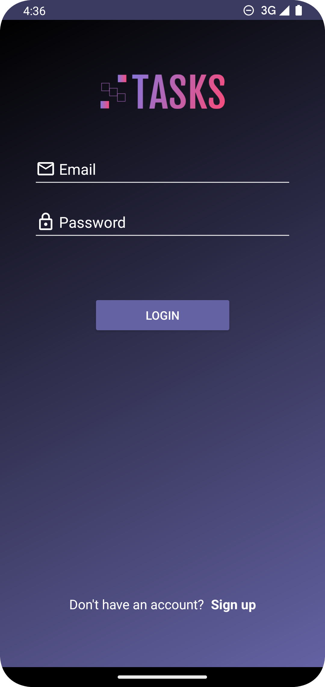
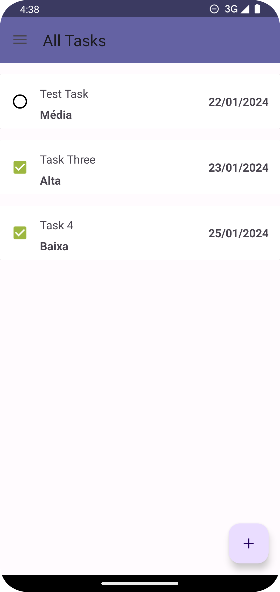
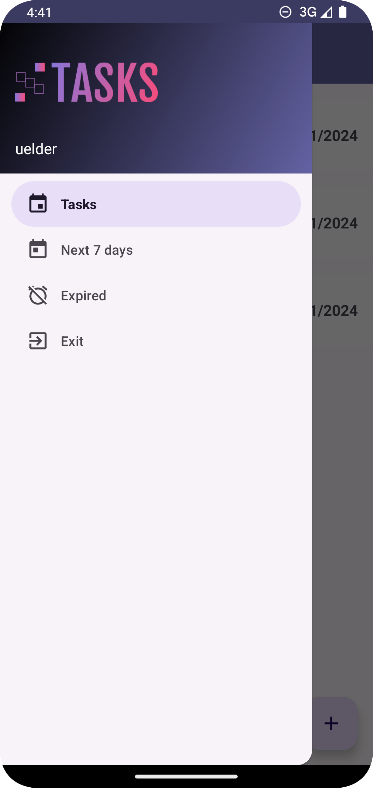
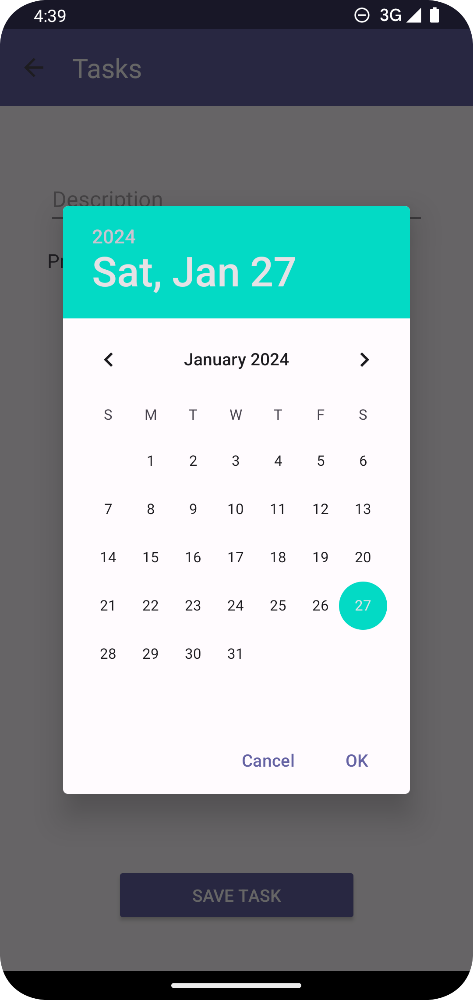
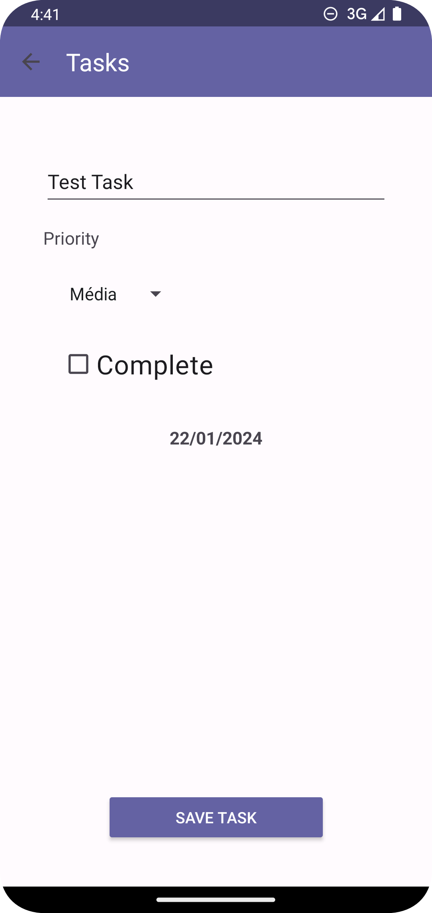
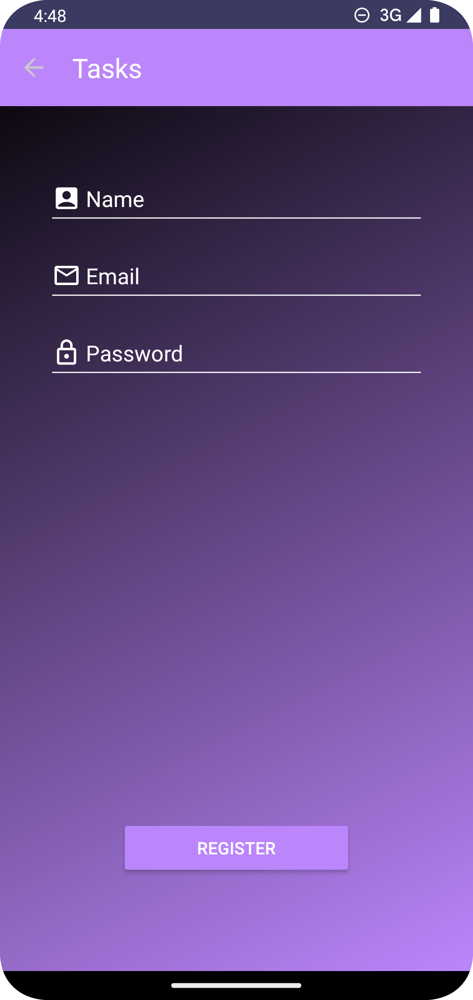
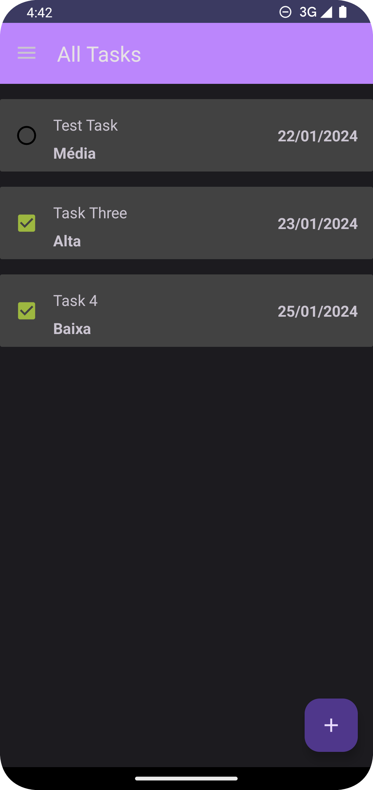
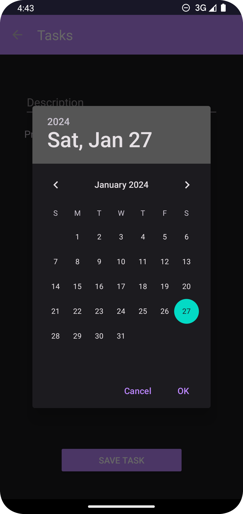
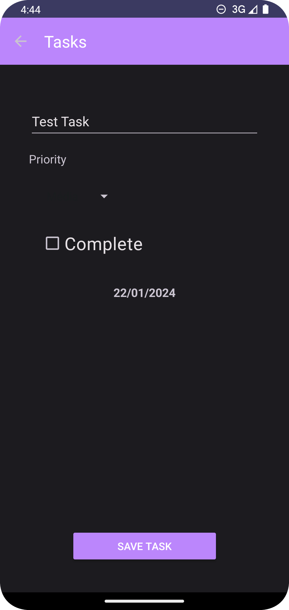

# Tasks

This repository was made as my solution to the exercise proposed in the 35th section of the [App Development Using Kotlin](https://www.udemy.com/course/curso-desenvolvedor-kotlin/) course - *Desenvolvimento de Aplicativos Android Usando Kotlin*, in portuguese. The way I have approached the development of this app is simple: first I've tried to code the app as close as possible to the result intended by the teacher. Then, I'll check the section to see how the teacher tackled the development of this app. This is the third exercise from this course that I have pushed to GitHub.

## Table of contents

- [Overview](#overview)
- [The challenge](#the-challenge)
- [What I learned](#what-i-learned)
- [Design Preview](#design-preview)
- [Light Theme](#light-theme)
- [Dark Theme](#dark-theme)
- [Link to previous lesson from the course](#link-to-previous-lesson-from-the-course)

## Overview

### The challenge

Users should be able to:
- Register an account with name, email and password
- Login with email and password
- See all saved tasks
- See tasks due in the next seven days
- See overdue tasks
- Create tasks. Each task has a description, a priority assigned to the task, a complete or incomplete status and a due date to complete the task
- Update tasks info
- Mark task complete or incomplete

### What I learned

Some of the things I have learned to do while coding this app were:
- Utilize a view model to manipulate data which will be shown in fragment
- Use coroutines and flows to be able to execute http requests with Retrofit
- How to utilize listeners to communicate between layers
- How to better utilize generics by creating generic functions, and generic interface methods
- Use Retrofit to fetch data from a remote REST API
- Use Retrofit to fetch data to a remote REST API
- How to format dates to a specific format
- How to use shared preferences to save data

It is important to know that I have expanded all the knowledge acquired from the previous project, linked in the final section of this document.

## Design Preview

### Light Theme

  
  

  

  
<small><em>Login Activity - Light Theme</em></small>  

  
   

  
  

  

  
<small><em>Sign Up Activity - Light Theme</em></small>  

  
   

  
  

  

  
<small><em>Main Content - Light Theme</em></small>  

  
   

  
  

  

  
<small><em>Navigation Drawer - Light Theme</em></small>  

  
   

  
  

  

  
<small><em>Task Form Activity - Light Theme</em></small>  

  
   

  
  

  

  
<small><em>Task Form Date Picker - Light Theme</em></small>  

  
   

  
  

  

  
<small><em>Filled Task Form - Light Theme</em></small>  

  
  

  

  
<small><em>Biometric Authentication - Light Theme</em></small>  

  

### Dark Theme

  
  

  

  
<small><em>Login Activity - Dark Theme</em></small>  

  
   

  
  

  

  
<small><em>Sign Up Activity - Dark Theme</em></small>  

  
   

  
  

  

  
<small><em>Main Content - Dark Theme</em></small>  

  
   

  
  

  

  
<small><em>Navigation Drawer - Dark Theme</em></small>  

  
   

  
  

  

  
<small><em>Task Form Activity - Dark Theme</em></small>  

  
   

  
  

  

  
<small><em>Task Form Date Picker - Dark Theme</em></small>  

  
   

  
  

  

  
<small><em>Filled Task Form - Dark Theme</em></small>  

  

  
  

  

  
<small><em>Biometric Authentication - Dark Theme</em></small>  

  

## Valuable Resources

Add Spinners to your app: https://developer.android.com/develop/ui/views/components/spinner

Add checkboxes to your app: https://developer.android.com/develop/ui/views/components/checkbox

Add pickers to your app: https://developer.android.com/develop/ui/views/components/pickers

Date and Time Formatting in Android: https://www.geeksforgeeks.org/date-and-time-formatting-in-android/

Setting Custom ActionBar Title from Fragment: https://www.youtube.com/watch?v=EJMrXwKiJOw

Implement Email Validator in Android: https://www.geeksforgeeks.org/implement-email-validator-in-android/

Retrofit documentation: https://square.github.io/retrofit/

Coroutines official documentation: https://kotlinlang.org/docs/coroutines-overview.html

Save data in a local database using Room: https://developer.android.com/training/data-storage/room

The Ultimate Guide to Kotlin Flows: https://www.youtube.com/playlist?list=PLQkwcJG4YTCQHCppNAQmLsj_jW38rU9sC

Show a Biometric Authentication Dialog: https://developer.android.com/training/sign-in/biometric-auth

## Link to previous lesson from the course

[Section 31 - Guests](https://github.com/helderzack/section-31st_guests)